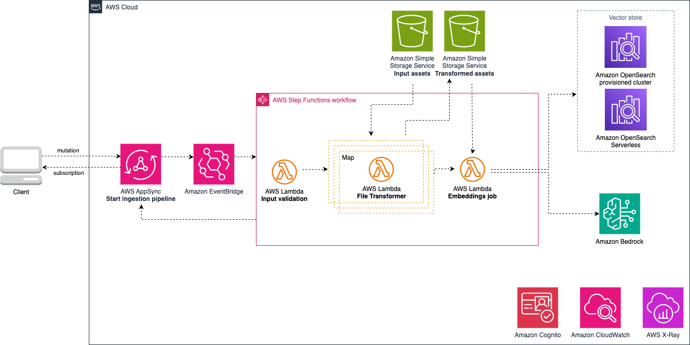

<!-- BEGIN_TF_DOCS -->
<!--BEGIN STABILITY BANNER-->

---


> All modules are under active development and subject to non-backward compatible changes or removal in any
> future version. These are not subject to the [Semantic Versioning](https://semver.org/) model.
> This means that while you may use them, you may need to update your source code when upgrading to a newer version of this package.

---
<!--END STABILITY BANNER-->

## Table of contents

- [Overview](#overview)
- [Initializer](#initializer)
- [Pattern Module Props](#pattern-module-props)
- [Pattern Properties](#pattern-properties)
- [Default properties](#default-properties)
- [Troubleshooting](#troubleshooting)
- [Architecture](#architecture)
- [Cost](#cost)
- [Security](#security)
- [Supported AWS Regions](#supported-aws-regions)
- [Quotas](#quotas)
- [Clean up](#clean-up)

## Overview

This Terraform module creates a pipeline for RAG (retrieval augmented generation) source. It ingests documents and then converts them into text formats. The output can be used for scenarios with long context windows. This means that your system can now consider and analyze a significant amount of surrounding information when processing and understanding text. This is especially valuable in tasks like language understanding and document summarization.

PDF files and images(.jpg,.jpeg,.svg,.png)  are uploaded to an input Amazon Simple Storage Service (S3) bucket. Authorized clients (Amazon Cognito user pool) will trigger an AWS AppSync mutation to start the ingestion process, and can use subscriptions to get notifications on the ingestion status. The mutation call will trigger an AWS Step Function with three different steps:
- Input validation: an AWS Lambda function will verify the input formats of the files requested for ingestion. If the files are in a format which is not supported by the pipeline, an error message will be returned.
- Transformation: the input files are processed in parallel using a [Map](https://docs.aws.amazon.com/step-functions/latest/dg/amazon-states-language-map-state.html) state through an AWS Lambda. The function uses the [LangChain](https://www.langchain.com/) client to get the content of each file and store the text file in the output bucket. This is useful for workflows which want to use a long context window approach and send the entire file as context to a large language model. If the file name already exists in the output bucket, the input file will not be processed.
For image files the the transformation step use [Amazon Rekognition](https://aws.amazon.com/rekognition/) to detect lables and image moderation. It then generate a descriptive text of the image using anthropic.claude-v2:1 and save the text file in processed s3 bucket.
- Embeddings step: Files processed and stored in the output S3 bucket are consumed by an AWS Lambda function. Chunks from documents are created, as well as text embeddings using Amazon Bedrock (model: amazon.titan-embed-text-v1). For uploaded images multimodality embeddings are created using Amazon Bedrock (model: amazon.titan-embed-image-v1)
The chunks and embeddings are then stored in a knowledge base (OpenSearch provisioned cluster). Make sure the model (amazon.titan-embed-text-v1,amazon.titan-embed-image-v1,anthropic.claude-v2:1) is enabled in your account. Please follow the [Amazon Bedrock User Guide](https://docs.aws.amazon.com/bedrock/latest/userguide/model-access.html) for steps related to enabling model access.

Documents stored in the knowledge base contain the following metadata:
- Timestamp: when the embeddings were created (current time in seconds since the Epoch)
- Embeddings model used: amazon.titan-embed-text-v1 , amazon.titan-embed-image-v1

If you have multiple workflows using GraphQL endpoints and want to use a single endpoint, you can use an [AppSync Merged API](https://docs.aws.amazon.com/appsync/latest/devguide/merged-api.html). This module can take as a parameter an existing AppSync Merged API; if provided, the mutation call and subscription updates will be targeted at the Merged API.

This module will require an existing Amazon OpenSearch provisioned cluster. You can follow the steps in the official [AWS Developer Guide](https://docs.aws.amazon.com/opensearch-service/latest/developerguide/createupdatedomains.html) to create and manage your OpenSearch domain.

AWS Lambda functions provisioned in this module use [Powertools for AWS Lambda (Python)](https://github.com/aws-powertools/powertools-lambda-python) for tracing, structured logging, and custom metrics creation. The table below provides the created metrics and the name of the service used, and can be accessed from Amazon CloudWatch Logs.

| **AWS Lambda**     | **Service**        | **Custom Metrics** |
|:-------------|:----------------|-----------------|
| input\_validation |INGESTION\_INPUT\_VALIDATION | SupportedFile (number of requests which provide a supported file format), UnsupportedFile (number of requests which provide an unsupported file format) |
| s3\_file\_transformer | INGESTION\_FILE\_TRANSFORMER | N/A |
| embeddings\_job | INGESTION\_EMBEDDING\_JOB | N/A |

After deploying the Terraform stack, the document summarization workflow can be invoked using GraphQL APIs. The API schema details are here: resources/gen-ai/aws-rag-appsync-stepfn-opensearch/schema.graphql.

The code below provides an example of a mutation call and associated subscription to trigger a pipeline call and get status notifications:

Subscription call to get notifications about the ingestion process:

```
subscription MySubscription {
  updateIngestionJobStatus(ingestionjobid: "123") {
    files {
      name
      status
      imageurl
    }
  }
}
_________________________________________________
Expected response:

{
  "data": {
    "updateIngestionJobStatus": {
      "files": [
        {
          "name": "a.pdf",
          "status": "succeed",
          "imageurl":"s3presignedurl"
        }
         {
          "name": "b.pdf",
          "status": "succeed",
          "imageurl":"s3presignedurl"
        }
      ]
    }
  }
}
```
Where:
- ingestionjobid: id which can be used to filter subscriptions on client side
The subscription will display the status and name for each file
- files.status: status update of the ingestion for the file specified
- files.name: name of the file stored in the input S3 bucket

Mutation call to trigger the ingestion process:

```
mutation MyMutation {
  ingestDocuments(ingestioninput: {
    embeddings_model:
      {
        provider: "Bedrock",
        modelId: "amazon.titan-embed-text-v1",
        streaming: true
      },
    files: [{status: "", name: "a.pdf"}],
    ingestionjobid: "123",
    ignore_existing: true}) {
    files {
      imageurl
      status
    }
    ingestionjobid
  }
}
_________________________________________________
Expected response:

{
  "data": {
    "ingestDocuments": {
      "ingestionjobid": null
    }
  }
}
```
Where:
- files.status: this field will be used by the subscription to update the status of the ingestion for the file specified
- files.name: name of the file stored in the input S3 bucket
- ingestionjobid: id which can be used to filter subscriptions on client side
- embeddings\_model: Based on type of modality (text or image ) the model provider , model id can be used.

## Default properties

Out of the box implementation of the module without any override will set the following defaults:

### Authentication

- Primary authentication method for the AppSync GraphQL API is Amazon Cognito User Pool.
- Secondary authentication method for the AppSync GraphQL API is IAM role.

### Networking

- Set up a VPC
    - Uses existing VPC if provided, otherwise creates a new one
- Set up a Security Group used by the AWS Lambda functions
    - Uses existing Security Group, otherwise creates a new one

### Amazon S3 Buckets

- Sets up two Amazon S3 Buckets
    - Uses existing buckets if provided, otherwise creates new ones

### Observability

By default the module will enable logging and tracing on all services which support those features. Observability can be turned off by setting the pattern property `observability` to `false`.
- AWS Lambda: AWS X-Ray, Amazon CloudWatch Logs
- AWS Step Function: AWS X-Ray, Amazon CloudWatch Logs
- AWS AppSync GraphQL API: AWS X-Ray, Amazon CloudWatch Logs

## Troubleshooting

| **Error Code**     | **Message**        | **Description** |**Fix** |
|:-------------|:----------------|-----------------|-----------------|
| | Ingested | The file provided as input was correctly ingested | Not an error, informational only |
| | Error - internal os error cannot connect | The embeddings Lambda function is not able to connect to the Amazon OpenSearch instance | Verify the credentials and network settings to ensure that the Lambda function is authorized to access the cluster |
| | Error\_File already exists | The file provided as input is already transformed in the output bucket | Remove the file from the transformed output bucket, and if needed also from the knowledge base |
| | Error\_Unable to load document | The Lambda transformer function was unable to load the document provided as input argument | Verify that the input file is located in the input bucket|
| | Error\_Unsupported | The input file document is in a format not supported by the workflow | Provide a file in a supported format |

## Architecture


## Cost

You are responsible for the cost of the AWS services used while running this module. As of this revision, the cost for running this module with the default settings in the US East (N. Virginia) Region is approximately $2,852.32 per month.

We recommend creating a budget through [AWS Cost Explorer](http://aws.amazon.com/aws-cost-management/aws-cost-explorer/) to help manage costs. Prices are subject to change. For full details, refer to the pricing webpage for each AWS service used in this solution.

The following table provides a sample cost breakdown for deploying this solution with the default parameters in the **US East (N. Virginia)** Region for **one month**.

| **AWS Service**     | **Dimensions**        | **Cost [USD]** |
|:-------------|:----------------|-----------------|
| AWS Step Functions | 15 requests per hour for data ingestion, each with 2 files (4 steps per workflow) | 0.99 |
| Amazon Virtual Private Cloud |  | 0.00 |
| AWS AppSync | 15 requests per hour to trigger data ingestion + (15 x 4 calls to notify clients through subscriptions) = 54,000 requests per month | 0.22 |
| Amazon EventBridge | 15 requests per hour = 10800 custom events per month | 0.01 |
| AWS Lambda | 15 ingestion requests per hour with 2 files each time, through 4 Lambda functions each allocated with 7076 MB of memory allocated and 512 MB of ephemeral storage allocated and an average run time of 30 seconds = 43200 requests per month | 142.59 |
| Amazon Simple Storage Service | 15 requests per hour for ingestion with 2 files in input format (PDF) with an average size of 1MB and transformed files to text format with an average size of 1 MB = 43.2 GB per month in S3 Standard Storage | 0.99 |
| Amazon Bedrock | Assumptions: On-Demand pricing with Titan Embeddings model to generate embeddings for 2 files of 1MB each per request at 15 requests per hour, which would represent ~2,5 million tokens per request as input. Max model input is 8k tokens per request and produces 1,536 tokens as output. 312.5 calls x $0.0001 for 1000 input tokens x 8k tokens/1000 = $0.25 per ingestion request x 15 requests per hour $3.75/h = $90/day x 30 = $2.7k per month | 2,700 |
| Amazon CloudWatch | 15 metrics using 5 GB data ingested for logs | 7.02 |
| AWS X-Ray | 100,000 requests per month through AppSync and Lambda calls | 0.50 |
| Total monthly cost | | 2,852.32 |

The resources not created by this module (Amazon Cognito User Pool, Amazon OpenSearch provisioned cluster, AppSync Merged API, AWS Secrets Manager secret) do not appear in the table above. You can refer to the decicated pages to get an estimate of the cost related to those services:
- [Amazon OpenSearch Service Pricing](https://aws.amazon.com/opensearch-service/pricing/)
- [AWS AppSync pricing (for Merged API if used)](https://aws.amazon.com/appsync/pricing/)
- [Amazon Cognito Pricing](https://aws.amazon.com/cognito/pricing/)
- [AWS Secrets Manager Pricing](https://aws.amazon.com/secrets-manager/pricing/)

> **Note**
>You can share the Amazon OpenSearch provisioned cluster between use cases, but this can drive up the number of queries per index and additional charges will apply.

## Security

When you build systems on AWS infrastructure, security responsibilities are shared between you and AWS. This [shared responsibility](http://aws.amazon.com/compliance/shared-responsibility-model/) model reduces your operational burden because AWS operates, manages, and controls the components including the host operating system, virtualization layer, and physical security of the facilities in which the services operate. For more information about AWS security, visit [AWS Cloud Security](http://aws.amazon.com/security/).

This module requires you to provide an existing Amazon Cognito User Pool and a provisioned Amazon OpenSearch cluster. Please refer to the official documentation on best practices to secure those services:
- [Amazon Cognito](https://docs.aws.amazon.com/cognito/latest/developerguide/security.html)
- [Amazon OpenSearch Service](https://docs.aws.amazon.com/opensearch-service/latest/developerguide/security.html)

Optionnaly, you can provide existing resources to the constructs (marked optional in the module pattern props). If you chose to do so, please refer to the official documentation on best practices to secure each service:
- [Amazon Simple Storage Service](https://docs.aws.amazon.com/AmazonS3/latest/userguide/security-best-practices.html)
- [Amazon VPC](https://docs.aws.amazon.com/vpc/latest/userguide/vpc-security-best-practices.html)
- [Amazon EventBridge](https://docs.aws.amazon.com/eventbridge/latest/userguide/eb-security.html)
- [AWS AppSync](https://docs.aws.amazon.com/appsync/latest/devguide/best-practices.html)
- [AWS Secrets Manager](https://docs.aws.amazon.com/config/latest/developerguide/security-best-practices-for-Secrets-Manager.html)

If you grant access to a user to your account where this module is deployed, this user may access information stored by the module (Amazon Simple Storage Service buckets, Amazon OpenSearch cluster, Amazon CloudWatch logs). To help secure your AWS resources, please follow the best practices for [AWS Identity and Access Management (IAM)](https://docs.aws.amazon.com/IAM/latest/UserGuide/best-practices.html).

AWS CloudTrail provides a number of security features to consider as you develop and implement your own security policies. Please follow the related best practices through the [official documentation](https://docs.aws.amazon.com/awscloudtrail/latest/userguide/best-practices-security.html).

> **Note**
> This module requires you to provide documents in the input assets bucket. You should validate each file in the bucket before using this module. See [here](https://cheatsheetseries.owasp.org/cheatsheets/File_Upload_Cheat_Sheet.html) for file input validation best practices.
> Ensure you only ingest the appropriate documents into your knowledge base. Any results returned by the knowledge base is eligible for inclusion into the prompt; and therefore, being sent to the LLM. If using a third-party LLM, ensure you audit the documents contained within your knowledge base.
> This module provides several configurable options for logging. Please consider security best practices when enabling or disabling logging and related features. Verbose logging, for instance, may log content of API calls. You can disable this functionality by ensuring observability flag is set to false.

## Supported AWS Regions

This solution optionally uses the Amazon Bedrock and Amazon OpenSearch service, which is not currently available in all AWS Regions. You must launch this module in an AWS Region where these services are available. For the most current availability of AWS services by Region, see the [AWS Regional Services List](https://aws.amazon.com/about-aws/global-infrastructure/regional-product-services/).

> **Note**
>You need to explicitly enable access to models before they are available for use in the Amazon Bedrock service. Please follow the [Amazon Bedrock User Guide](https://docs.aws.amazon.com/bedrock/latest/userguide/model-access.html) for steps related to enabling model access.

## Quotas

Service quotas, also referred to as limits, are the maximum number of service resources or operations for your AWS account.

Make sure you have sufficient quota for each of the services implemented in this solution. For more information, refer to [AWS service quotas](https://docs.aws.amazon.com/general/latest/gr/aws_service_limits.html).

To view the service quotas for all AWS services in the documentation without switching pages, view the information in the [Service endpoints and quotas](https://docs.aws.amazon.com/general/latest/gr/aws-general.pdf#aws-service-information) page in the PDF instead.

## Clean up

When deleting your stack which uses this module, do not forget to go over the following instructions to avoid unexpected charges:
  - empty and delete the Amazon Simple Storage Bucket(s) created by this module if you didn't provide existing ones during the module creation
  - empty the data stored in the knowledge base (Amazon OpenSearch provisioned cluster), as well as the index created if an existing one was not provided
  - if the observability flag is turned on, delete all the associated logs created by the different services in Amazon CloudWatch logs

***
&copy; Copyright Amazon.com, Inc. or its affiliates. All Rights Reserved.

## Requirements

| Name | Version |
|------|---------|
| <a name="requirement_terraform"></a> [terraform](#requirement\_terraform) | >= 1.0.0 |
| <a name="requirement_aws"></a> [aws](#requirement\_aws) | >=5.8.0 |
| <a name="requirement_awscc"></a> [awscc](#requirement\_awscc) | >= 0.78.0 |
| <a name="requirement_docker"></a> [docker](#requirement\_docker) | >=3.0.0 |
| <a name="requirement_local"></a> [local](#requirement\_local) | >=2.5.0 |
| <a name="requirement_null"></a> [null](#requirement\_null) | >= 3.2.0 |
| <a name="requirement_random"></a> [random](#requirement\_random) | >= 3.6.0 |

## Providers

| Name | Version |
|------|---------|
| <a name="provider_aws"></a> [aws](#provider\_aws) | >=5.8.0 |
| <a name="provider_awscc"></a> [awscc](#provider\_awscc) | >= 0.78.0 |
| <a name="provider_random"></a> [random](#provider\_random) | >= 3.6.0 |

## Modules

| Name | Source | Version |
|------|--------|---------|
| <a name="module_document_ingestion"></a> [document\_ingestion](#module\_document\_ingestion) | ./modules/document-ingestion | n/a |
| <a name="module_networking_resources"></a> [networking\_resources](#module\_networking\_resources) | ./modules/networking-resources | n/a |
| <a name="module_persistence_resources"></a> [persistence\_resources](#module\_persistence\_resources) | ./modules/persistence-resources | n/a |
| <a name="module_question_answering"></a> [question\_answering](#module\_question\_answering) | ./modules/question-answering | n/a |
| <a name="module_summarization"></a> [summarization](#module\_summarization) | ./modules/summarization | n/a |

## Resources

| Name | Type |
|------|------|
| [awscc_appsync_source_api_association.document_ingestion_association](https://registry.terraform.io/providers/hashicorp/awscc/latest/docs/resources/appsync_source_api_association) | resource |
| [awscc_appsync_source_api_association.question_answering_association](https://registry.terraform.io/providers/hashicorp/awscc/latest/docs/resources/appsync_source_api_association) | resource |
| [awscc_appsync_source_api_association.summarization_association](https://registry.terraform.io/providers/hashicorp/awscc/latest/docs/resources/appsync_source_api_association) | resource |
| [random_string.solution_prefix](https://registry.terraform.io/providers/hashicorp/random/latest/docs/resources/string) | resource |
| [aws_caller_identity.current](https://registry.terraform.io/providers/hashicorp/aws/latest/docs/data-sources/caller_identity) | data source |

## Inputs

| Name | Description | Type | Default | Required |
|------|-------------|------|---------|:--------:|
| <a name="input_container_platform"></a> [container\_platform](#input\_container\_platform) | The platform for the container image, default is 'linux/amd64' | `string` | `"linux/amd64"` | no |
| <a name="input_force_destroy"></a> [force\_destroy](#input\_force\_destroy) | Set to true if you want to force delete resources created by this module | `bool` | `false` | no |
| <a name="input_open_search_props"></a> [open\_search\_props](#input\_open\_search\_props) | Properties for the OpenSearch configuration | `any` | <pre>{<br>  "cluster_config": {<br>    "dedicated_master_count": 4,<br>    "dedicated_master_enabled": true,<br>    "dedicated_master_type": "c6g.large.search",<br>    "instance_count": 4,<br>    "instance_type": "r6g.large.search",<br>    "zone_awareness_config": {<br>      "availability_zone_count": 2<br>    },<br>    "zone_awareness_enabled": true<br>  },<br>  "collection_name": "rag-collection",<br>  "domain_name": "opensearch",<br>  "ebs_options": {<br>    "ebs_enabled": true,<br>    "volume_size": 10,<br>    "volume_type": "gp3"<br>  },<br>  "engine_version": "OpenSearch_1.0",<br>  "index_name": "doc-rag-search",<br>  "open_search_service_type": "aoss",<br>  "secret": "NONE",<br>  "standby_replicas": 2<br>}</pre> | no |
| <a name="input_solution_prefix"></a> [solution\_prefix](#input\_solution\_prefix) | Prefix to be included in all resources deployed by this solution | `string` | `"aws-ia"` | no |
| <a name="input_tags"></a> [tags](#input\_tags) | Map of tags to apply to resources deployed by this solution. | `map(any)` | `null` | no |
| <a name="input_vpc_props"></a> [vpc\_props](#input\_vpc\_props) | Properties for the VPC to be deployed. Error if both this and 'deploy\_vpc' are provided | `any` | <pre>{<br>  "az_count": 2,<br>  "cidr_block": "10.0.0.0/20",<br>  "subnets": {<br>    "private": {<br>      "connect_to_public_natgw": true,<br>      "netmask": 24<br>    },<br>    "public": {<br>      "nat_gateway_configuration": "all_azs",<br>      "netmask": 24<br>    }<br>  },<br>  "vpc_flow_logs": {<br>    "log_destination_type": "cloud-watch-logs",<br>    "retention_in_days": 180<br>  }<br>}</pre> | no |

## Outputs

| Name | Description |
|------|-------------|
| <a name="output_authenticated_role_arn"></a> [authenticated\_role\_arn](#output\_authenticated\_role\_arn) | The authenticated role ARN. |
| <a name="output_client_id"></a> [client\_id](#output\_client\_id) | The Cognito client ID. |
| <a name="output_client_name"></a> [client\_name](#output\_client\_name) | The Cognito client name. |
| <a name="output_cognito_domain"></a> [cognito\_domain](#output\_cognito\_domain) | The Cognito domain. |
| <a name="output_cognito_user_client_secret"></a> [cognito\_user\_client\_secret](#output\_cognito\_user\_client\_secret) | ARN of the AWS Secrets Manager secret for Cognito client secret key. |
| <a name="output_graphql_endpoint"></a> [graphql\_endpoint](#output\_graphql\_endpoint) | The GraphQL endpoint. |
| <a name="output_identity_pool_id"></a> [identity\_pool\_id](#output\_identity\_pool\_id) | The Cognito identity pool ID. |
| <a name="output_region"></a> [region](#output\_region) | The AWS region. |
| <a name="output_s3_input_bucket"></a> [s3\_input\_bucket](#output\_s3\_input\_bucket) | The S3 input bucket. |
| <a name="output_s3_processed_bucket"></a> [s3\_processed\_bucket](#output\_s3\_processed\_bucket) | The S3 processed bucket. |
| <a name="output_user_pool_id"></a> [user\_pool\_id](#output\_user\_pool\_id) | The Cognito user pool ID. |
<!-- END_TF_DOCS -->